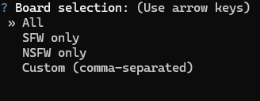
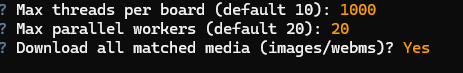
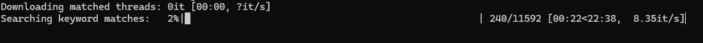
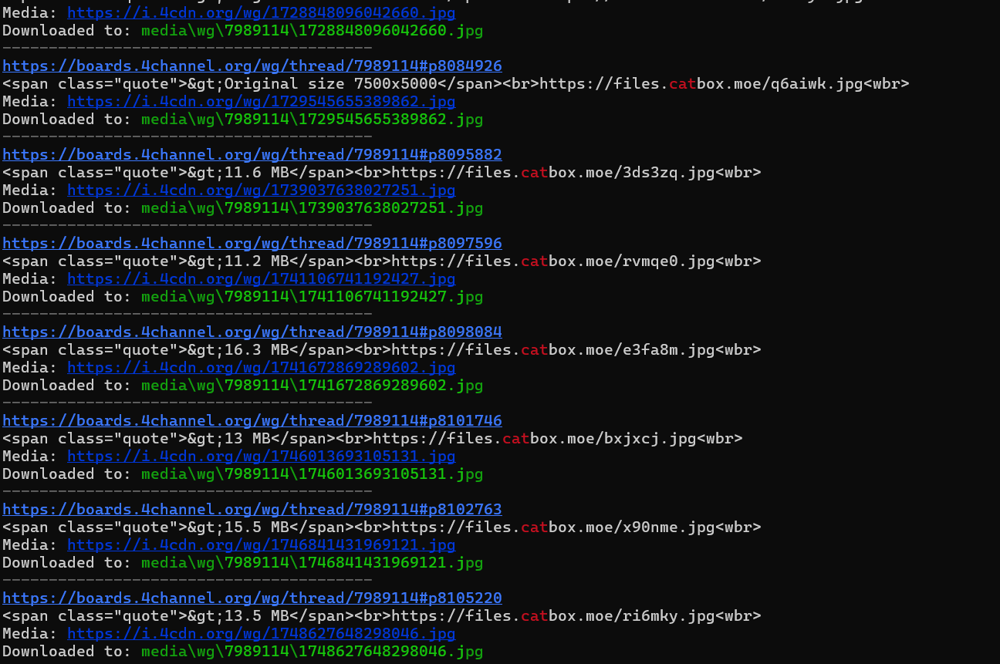
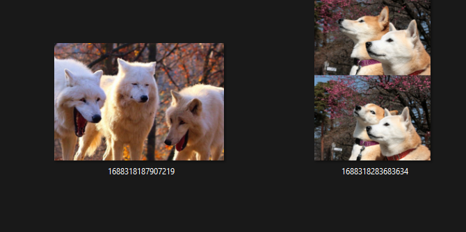

# 4chan OSINT Scraper & Media Downloader

A powerful CLI tool for parallel searching, scraping, and media downloading from 4chan boards.  
Perfect for open-source intelligence (OSINT), research, and archiving.

---


---

## Features

- 🔍 **Regex & Keyword Search:** Search threads and posts on selected 4chan boards using keywords or regex.
- 🧵 **Thread & Post Scraping:** Finds matches in thread titles or post contents.
- 🎨 **Terminal Highlighting:** Colorful keyword highlighting for quick visual parsing.
- ⚡ **Parallel Processing:** Multi-threaded search and downloads for speed.
- 💾 **Media Archiving:** Optionally download all matched images/webms from threads or posts.
- 🛡️ **SFW/NSFW Filtering:** Choose SFW, NSFW, or custom board lists.
- 🐍 **Easy to Use:** Interactive CLI (built with `questionary`), progress bars, and clear feedback.

---

## Demo & Usage

### 1. Launch the Script

```sh
python chan7.py
```

### 2. Select Boards



Choose which boards to search: All, SFW, NSFW, or custom.

### 3. Set Search Parameters

- Enter your keyword or regular expression.
- Set thread and worker limits as needed.



**Why such a high "Max threads per board" number?**  
4chan boards can have a large number of active threads, and some boards move very quickly. Setting a high maximum (like 1000) ensures that you can search through every active thread on a board without missing any potential matches. This is especially useful for comprehensive OSINT tasks or research where completeness is critical. If the number is set too low, you might miss newer or less active threads.

### 4. Progress Bars

Watch the progress as threads are searched and media is downloaded in parallel.



### 5. Results Example

Once complete, results and media locations are shown.



---

## Downloaded Media Example

A preview of the downloaded files from a search:



---

## Installation

### Requirements

- Python 3.8+
- [pip](https://pip.pypa.io/en/stable/installation/)

### Install Dependencies

```sh
pip install -r requirements.txt
```

**(Requirements file should include: `requests`, `tqdm`, `rich`, `questionary`)**

---

## Usage Tips

- Use simple keywords (e.g. `dog|cat|fox`) or advanced regex for flexible searches.
- Large thread/worker counts speed up scraping, but may strain your network or get temporary blocks.
- Downloads are organized by board/thread in the `media/` directory.
- Works on Windows, Linux, macOS.

---

## License

MIT License

---

## Credits

- Inspired by OSINT needs, built with ❤️ using Open Source Python libraries.
- Banner generated using ASCII art tools.

---

## Disclaimer

- This tool is for educational and research purposes only.
- Respect 4chan's robots.txt and fair use policies.
- The author is not responsible for any misuse.
